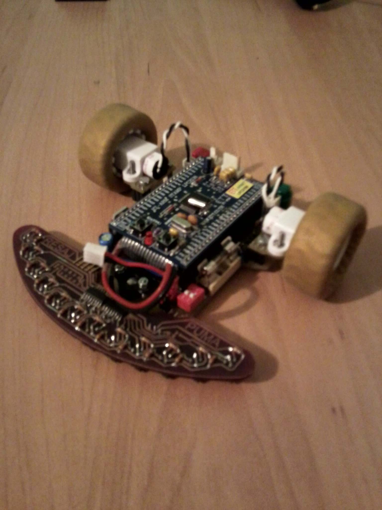

# Pumatrón V1
Pumatrón es mi primer robot de competición. Participó entre 2011 y 2013 en numerosas pruebas, como Alcabot, Cybertech, Robolid...

Se trata de un robot modular y autosoportado, capaz de adaptarse fácilmente a diferentes pruebas como rastreadores, velocistas, laberinto...

## Autor
[Rubén Espino San José](https://github.com/Resaj)

## License

Todos estos productos están liberados mediante [Creative Commons Attribution-ShareAlike 4.0 International License](http://creativecommons.org/licenses/by-sa/4.0/).  
_All these products are released under [Creative Commons Attribution-ShareAlike 4.0 International License](http://creativecommons.org/licenses/by-sa/4.0/)._
